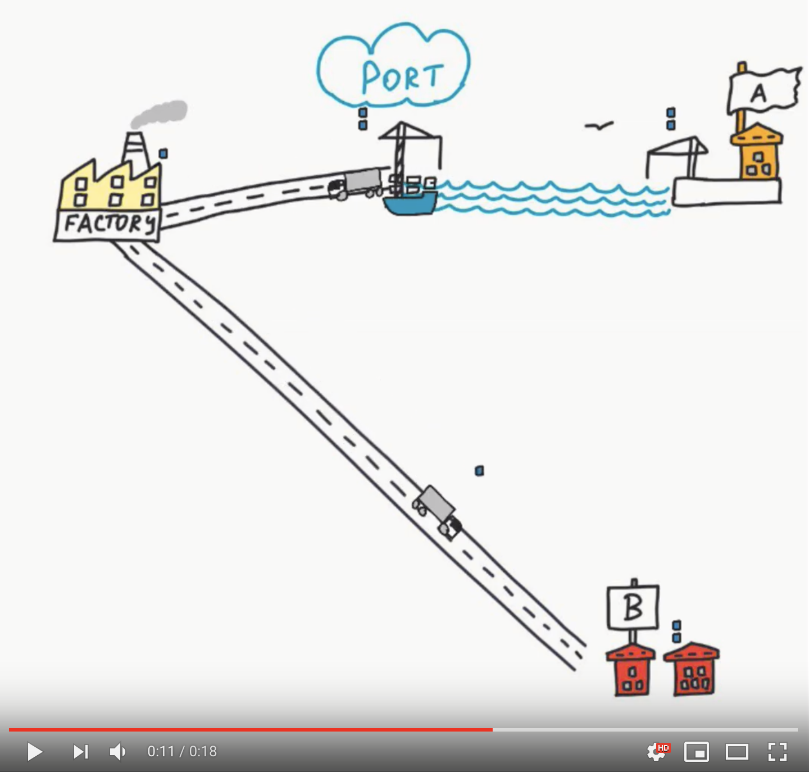

# Transport Tyccon visualization

A visualization for the events used in the [Transport Tyccon Kata](https://github.com/Softwarepark/exercises/tree/master/transport-tycoon).
It shows the simulation results of a particular solution based on its event stream.

The file must contain an event per line with the format specified in [Event Format](https://github.com/Softwarepark/exercises/blob/master/transport-tycoon-2.md). The file itself must be named after the scenario, e.g. `AABBAB.log`

## Running a visualization

Just open `index.html` in a browser, either from localhost or from a web server!

The following ways to visualize a scenario are available:

- The default scenario is loaded when no parameters are specified
- Using the query parameter `scenario=<relative-file-path>` to specify the file to be loaded an visualized.
  Note: its relative to the `index.html` file and will only be loaded when used from a web server (due to CORS constraints from `localhost`)
- Just use `scenario` without any value and then manually upload a file

Other options for the visualization

- use `speed=<value>` as query parameter to increase or decrease the simulation speed (`0.05` is a good default)
- use `showLogs=false` to hide the log output

Sample visualizations

- `ABB` with no logs [https://htmlpreview.github.io/?https://github.com/Nagelfar/transport-tycoon/blob/enhancements/transport_visulazation/index.html?speed=0.05&scenario=outputs%2FABB.log&showLogs=false](https://htmlpreview.github.io/?https://github.com/Nagelfar/transport-tycoon/blob/enhancements/transport_visulazation/index.html?speed=0.05&scenario=outputs%2FABB.log&showLogs=false)
- `ABBBABAAABBB` with slower speed an logs [https://htmlpreview.github.io/?https://github.com/Nagelfar/transport-tycoon/blob/enhancements/transport_visulazation/index.html?speed=0.02&scenario=outputs%2FABBBABAAABBB.log](https://htmlpreview.github.io/?https://github.com/Nagelfar/transport-tycoon/blob/enhancements/transport_visulazation/index.html?speed=0.02&scenario=outputs%2FABBBABAAABBB.log)